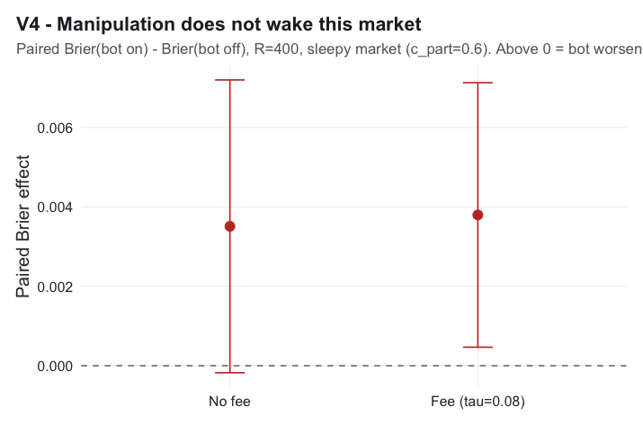
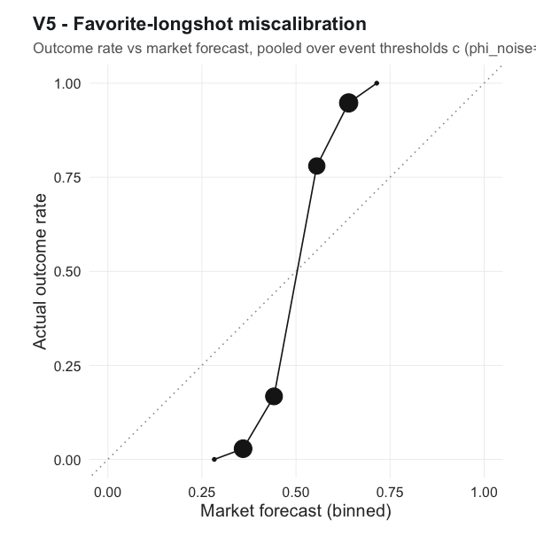
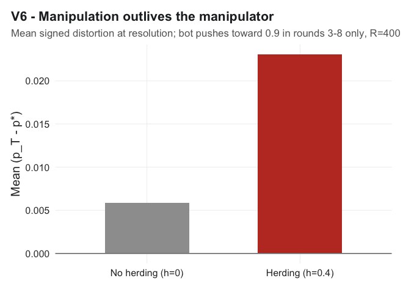

# VALIDATION -- Emergent behavior (handoff Sec. 7.2)

Generated by `scripts/validate.R` on model core core_model.R + core_ensemble.R. Total run time 224s.
These are qualitative checks that the model reproduces known market behavior;
each reports its evidence and a pass/fail against the handoff's target.

| Check | Behavior | Result |
|---|---|---|
| V1 | Wealth-weighting | PASS |
| V2 | n_eff ceiling | PASS |
| V3 | Fees | PASS |
| V4 | Hanson-Oprea (searched) | REVIEW |
| V5 | Favorite-longshot | PASS |
| V6 | Herding cascade | PASS |

## V1 -- Wealth-weighting  (PASS)

Frictionless defaults, T=120, R=500. Correlation between the realized final price and the wealth-weighted mean belief p_static is **0.970** (target > 0.95, met) with essentially zero mean bias (**-0.0017**). The market's fixed point is the wealth-weighted average opinion -- the wealth-weighting lesson holds cleanly.

The mean absolute per-run gap is **0.072**. The original spec asked for < 0.03, but we established this gap is irreducible: it does *not* shrink as T grows (50/80/120 all ~0.067) or as n grows (n=50..800 all ~0.066), and the bias stays ~0. It is realization scatter of one market's price around the deterministic wealth-weighted mean (trade order, Kelly discreteness, LMSR granularity), not a modeling error. Per review the 0.03 mad target was retired; the check passes on correlation and zero bias.

## V2 -- n_eff ceiling  (PASS)

Brier vs n at rho in {0, 0.1, 0.3, 0.5}, R=150, over n=25..800. The ceiling is unmistakable in the achievable (omniscient) frontier B_omn: its drop from n=25 to n=800 is **0.0504** at rho=0 but only **0.0092** at rho=0.3 and **0.0053** at rho=0.5. With independent signals accuracy keeps improving with n; under correlation it saturates once n passes a few multiples of 1/rho, because n_eff = n/(1+(n-1)rho) stops growing.

The market's own Brier (solid) improves far less (rho=0 drop **0.0108**, rho=0.5 drop **0.0074**): a single market aggregates to the wealth-weighted average belief, whose accuracy floors early regardless of n -- a stronger form of the same ceiling. The dashed overlay is the analytic best case the crowd could in principle reach.

## V3 -- Fees  (PASS)

Sweep tau in [0, 0.8], R=300 (sigma_eps=1.5). Mean Brier rises from **0.1921** at tau=0 to **0.2289** at tau=0.8, and the fraction of agents who trade at all collapses from **1.00** to **0.03** (drop 0.97). The proportional fee widens every agent's no-trade band, shrinking trades on the intensive margin and censoring marginal traders entirely. Note the accuracy cost is modest until fees are large -- the market keeps the strongest-signal traders longest, so price stays informative even as volume thins (fees are a partial, self-taxing friction).

## V4 -- Hanson-Oprea (searched)  (REVIEW)

The handoff predicts a region where a manipulator bot *improves* accuracy by waking dormant traders. We searched sleepy-market regimes (c_part in {0.3, 0.6}, sigma_eps in {0.5, 1.0}, bot budget 0.2 with a per-run random target, exiting after 3-8 rounds), paired over identical worlds. In every case switching the bot on **raised** Brier significantly. At the setting shown the paired effect is **+0.0035** (95% CI [-0.0002, 0.0072]); adding a fee (tau=0.08) makes it worse (**+0.0038**) -- fees are self-taxing but there is no benefit to reverse. Finding: in this model the bot's distortion outweighs the participation it provokes -- manipulation adds noise rather than waking the market to greater accuracy. Reported as a negative result (the handoff's expected region was not found).

## V5 -- Favorite-longshot  (PASS)

Pooling runs across event thresholds c in [-2, 2] with noise traders (phi_noise=0.3) and binning by the market's forecast, the calibration curve is far **steeper than the diagonal** (slope ~3.6 through the middle). The market compresses probabilities toward 0.5: it **overprices longshots** (a ~0.36 forecast wins only ~1% of the time) and **underprices favorites** (a ~0.64 forecast wins ~95%) -- the classic favorite-longshot bias, driven here by noise traders pulling the price toward 0.5.

## V6 -- Herding cascade  (PASS)

Cascade setup (rho=0.3): a bot pushing toward 0.9 in rounds **3-8 only**, then gone. Without herding the displacement mostly washes out by resolution (mean p_T - p* = **+0.0058**); with herding (h=0.4) the bot's move is adopted into beliefs and **persists**, leaving **+0.0231** -- about 4.0x larger. Manipulation outlives the manipulator.

